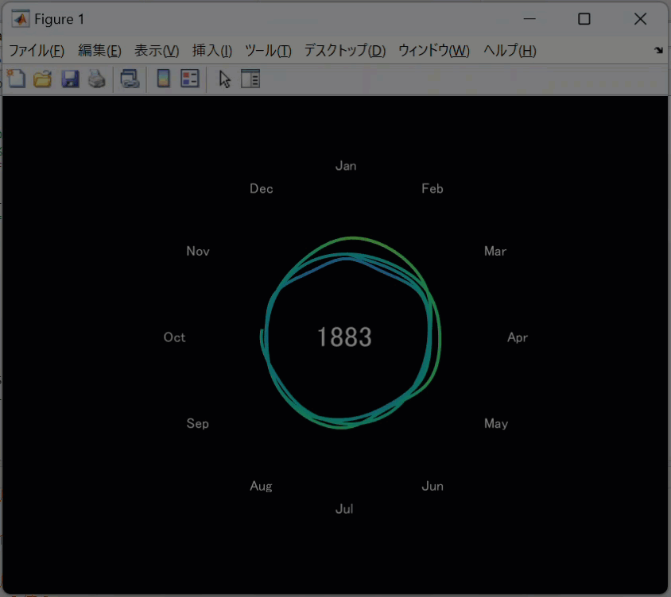

# MATLAB Visualization Exercise - Average Temperature of the Earth
Copyright (c) 2023 Michio Inoue.

This repo provides MATLAB script to generate an animation of averate temperature of the Earth.
The original is generated by NASA and posted here on X: [https://twitter.com/NASA/status/1691106509319806977](https://twitter.com/NASA/status/1691106509319806977)

