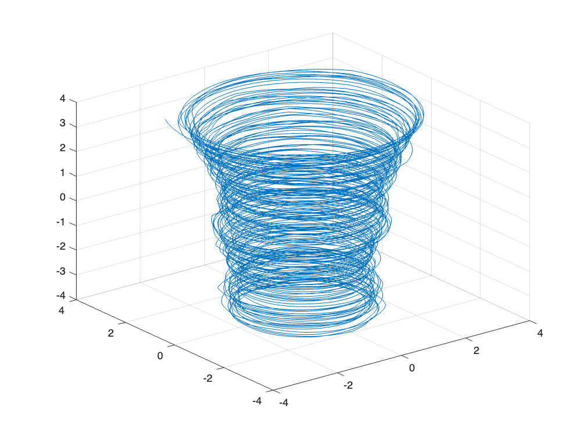
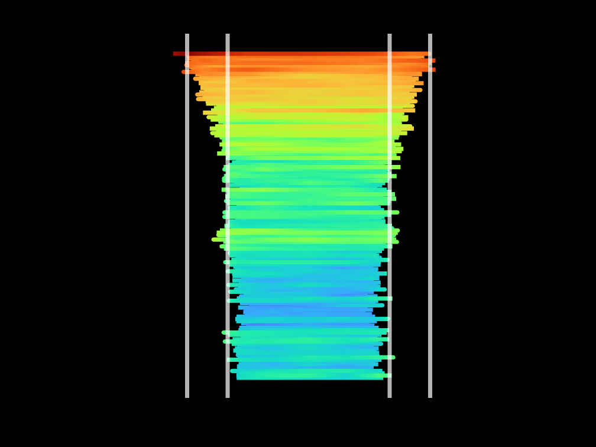

<a name="T_34F335D5"></a>
# <span style="color:rgb(213,80,0)">Visualization exercise: Earth Average temperature </span>

Copyright (c) 2023 Michio Inoue.

<a name="H_09D33063"></a>
# やったこと

見覚えがある方もいらっしゃると思います、NASA が作成した地球の[平均気温のプロット](https://twitter.com/NASA/status/1691106509319806977)。


関連ブログ：[Data Visualization shows the global temperature change since 1850](https://blogs.mathworks.com/headlines/2017/06/01/data-visualization-shows-the-global-temperature-change-since-1850/)


これを MATLAB で書いてみました。**てか 2023 年暑すぎません！？**

<p style="text-align:left"></p>


可視化のポイントとしては

-  背景色・文字配置・極座標系っぽいプロット 
-  温度に合わせて線・文字の色を変える 
-  プロット後の 90 度回転 
-  回転前に文字を消す 

あたり。全部のステップを1つずつ解説します！


面白いプロットを MATLAB で再現試みてみる自己満足プロジェクト、どこか参考になる部分がありましたら嬉しいです。

<a name="H_1B45FB49"></a>
## 実行環境
-  R2023b (MATLAB 本体のみ） 
<a name="H_D31A8EF2"></a>
# まずはデータ準備・ざっくり可視化

幸いデータはこちらに見つかりましたので最新データをとってきます。


[https://svs.gsfc.nasa.gov/4975](https://svs.gsfc.nasa.gov/4975)

```matlab
if exist('temperature.mat','file')
    load temperature.mat
else
    data = readtable('https://data.giss.nasa.gov/gistemp/tabledata_v4/GLB.Ts+dSST.csv');
    save('temperature.mat','data');
end
head(data)
```

```TextOutput
    Year     Jan      Feb      Mar      Apr      May      Jun      Jul      Aug      Sep      Oct      Nov      Dec      J_D      D_N      DJF      MAM      JJA      SON 
    ____    _____    _____    _____    _____    _____    _____    _____    _____    _____    _____    _____    _____    _____    _____    _____    _____    _____    _____
    1880    -0.19    -0.24    -0.09    -0.16     -0.1    -0.21    -0.17     -0.1    -0.14    -0.23    -0.21    -0.18    -0.17      NaN      NaN    -0.12    -0.16    -0.19
    1881    -0.19    -0.14     0.03     0.05     0.07    -0.19        0    -0.04    -0.15    -0.22    -0.19    -0.07    -0.09    -0.09    -0.17     0.05    -0.07    -0.19
    1882     0.16     0.14     0.05    -0.17    -0.14    -0.23    -0.16    -0.07    -0.14    -0.23    -0.16    -0.36    -0.11    -0.08     0.08    -0.09    -0.15    -0.18
    1883    -0.29    -0.37    -0.12    -0.18    -0.18    -0.07    -0.07    -0.14    -0.22    -0.11    -0.24    -0.11    -0.18     -0.2    -0.34    -0.16    -0.09    -0.19
    1884    -0.13    -0.08    -0.36     -0.4    -0.34    -0.35    -0.31    -0.28    -0.27    -0.25    -0.33    -0.31    -0.28    -0.27    -0.11    -0.37    -0.31    -0.28
    1885    -0.58    -0.34    -0.27    -0.42    -0.45    -0.44    -0.34    -0.31    -0.28    -0.23    -0.24    -0.11    -0.33    -0.35    -0.41    -0.38    -0.36    -0.25
    1886    -0.44    -0.51    -0.43    -0.28    -0.24    -0.34    -0.18    -0.31    -0.24    -0.27    -0.28    -0.25    -0.31     -0.3    -0.35    -0.31    -0.27    -0.26
    1887    -0.72    -0.57    -0.36    -0.35    -0.31    -0.25    -0.26    -0.36    -0.25    -0.35    -0.26    -0.33    -0.36    -0.36    -0.51    -0.34    -0.29    -0.29
```

1880 年 1 月 から 2023 年 11 月までの毎月データが読み込めました。 2列目から13列目に Jan ~ Dec の気温が入っています。


（何らかの基準気温からの差分データのようですが・・どこが 0 度なのかはまだ見つけられていません・・）


データの最後を見てみると、、

```matlab
tail(data)
```

```TextOutput
    Year    Jan     Feb     Mar     Apr     May     Jun     Jul     Aug     Sep     Oct     Nov     Dec     J_D     D_N     DJF     MAM     JJA     SON 
    ____    ____    ____    ____    ____    ____    ____    ____    ____    ____    ____    ____    ____    ____    ____    ____    ____    ____    ____
    2016    1.17    1.37    1.36     1.1    0.95     0.8    0.85    1.02     0.9    0.89    0.92    0.87    1.02    1.04    1.23    1.14    0.89     0.9
    2017    1.03    1.14    1.17    0.94    0.92    0.72    0.82    0.87    0.77     0.9    0.88    0.93    0.92    0.92    1.01    1.01     0.8    0.85
    2018    0.82    0.85    0.89    0.89    0.82    0.77    0.83    0.77     0.8    1.02    0.82    0.91    0.85    0.85    0.87    0.87    0.79    0.88
    2019    0.93    0.95    1.17    1.02    0.85     0.9    0.95    0.95    0.93       1    0.99    1.09    0.98    0.96    0.93    1.01    0.93    0.97
    2020    1.17    1.24    1.17    1.13    1.01    0.91     0.9    0.87    0.98    0.88     1.1    0.81    1.02    1.04    1.17     1.1    0.89    0.99
    2021    0.81    0.64    0.89    0.76    0.78    0.84    0.92    0.82    0.92       1    0.94    0.86    0.85    0.84    0.75    0.81    0.86    0.95
    2022    0.91    0.89    1.05    0.83    0.84    0.92    0.94    0.95    0.89    0.96    0.72     0.8    0.89     0.9    0.89    0.91    0.94    0.86
    2023    0.87    0.97     1.2       1    0.93    1.08    1.18    1.19    1.47    1.34    1.44     NaN     NaN    1.12    0.88    1.05    1.15    1.42
```

最後の方見てみると、データが無い部分は NaN になってます。１点ずつプロットしやすいように、上のデータを一列に並べておきたいと思います。


stack 関数で月別の変数を縦に全部並べちゃいます。そして NaN は除去しておきます。

```matlab
datas = stack(data(:,1:13),2:13,...
    NewDataVariableName = 'Temperature',...
    IndexVariableName = 'Month');
datas = rmmissing(datas) % NaN 除去
```
| |Year|Month|Temperature|
|:--:|:--:|:--:|:--:|
|1|1880|Jan|-0.1900|
|2|1880|Feb|-0.2400|
|3|1880|Mar|-0.0900|
|4|1880|Apr|-0.1600|
|5|1880|May|-0.1000|
|6|1880|Jun|-0.2100|
|7|1880|Jul|-0.1700|
|8|1880|Aug|-0.1000|
|9|1880|Sep|-0.1400|
|10|1880|Oct|-0.2300|
|11|1880|Nov|-0.2100|
|12|1880|Dec|-0.1800|
|13|1881|Jan|-0.1900|
|14|1881|Feb|-0.1400|


いい感じです。

<a name="H_D1F5283D"></a>
## データの整形

まずどんなデータが入っているか確認するためにざっくりプロット。

```matlab
plot(datas.Temperature);
fontsize(15,'points') % デフォルトの文字サイズちょっと小さいですよね・・
grid on
```

<center></center>


何らかの値（平均値？）からの変動とみられるデータになっています。


今回は極座標的に半径を温度値（変動値 + 2）、そして月を角度で表現するので、以下の処理を行います。

-  極座標プロットで負の値があると都合が悪いので + 2 しておきます。 
-  極座標プロットでの原点からの距離を"温度"、角度を"月" とします。 
-  年の数字を高さ（z 軸）とします。1 月と 12 月で高さを変えてもいいけどここではひとまず同じ高さとする。 
-  （ただ、後で原点を中心に回転させやすいように・・ [-4,4] の間にスケールしておきます） 
-  直交座標に変換（<samp>pol2cart</samp> 関数）してプロットします（**theta = 0 は x 軸と並行で反時計回り**な点に注意） 

<samp>polarplot</samp> 関数で直接描くのもありですが、パッと試したところ細かいところで不自由（蜘蛛の巣みたいな補助線を消せないとか）でした（良い方法ありましたら教えてください！）

```matlab
% 半径
radius = datas.Temperature + 2;

% 角度：Jan 0*delta ~ Dec 11*delta;
delta = 2*pi/12;
theta = (0:height(datas)-1)'*delta;

% Cartesian に変換
[x,y] = pol2cart(-theta+pi/2,radius); %theta = 0 は x 軸と並行で反時計回り

% z 軸は正規化した年（後から回転しやすいように！）
year = datas.Year;
z = rescale(year,-4,4); % -4,4 の幅にスケールしておきます

plot3(x,y,z)
grid on
```

<center></center>


各月を直線で結んでいるので当然のことながらちょっと滑らかさに欠けます。

<a name="H_B10709B1"></a>
## ざっくり内挿して滑らかに

各月の間に点を作ります。（ここでは試しに m = ４点）

```matlab
N = length(theta); % もとのデータ長さ
m = 4;
xq = linspace(1,N,(N-1)*(m+1)+1); % 間に均等に 4 点追加する場合の内挿点

% interp1 で内挿
thetam = interp1(theta,xq)'; % 角度
radiusm = interp1(radius,xq)'; % 半径
zm = interp1(z,xq)'; % 高さ

% 年数は内挿してもしょうがないので、前の点で埋めます。
yearm = interp1(year,xq,"previous")';

% Cartesian に変換
[xm,ym] = pol2cart(-thetam+pi/2,radiusm); %theta = 0 は x 軸と並行で反時計回り
plot3(xm,ym,zm)
grid on
```

<center></center>


スムーズになりました。

<a name="H_34A30AF8"></a>
# 線に温度に応じた色を付ける

温度（中心からの距離）に応じて色を変えまます。高いと赤、低いと青ということで turbo カラーマップを使用します。


線に単色を付けること自体は簡単・直感的ですが、値に応じて色を付けるの？？ということで"値に応じて線に色をつける方法" で検索するとこちらが出てきました。


[https://stackoverflow.com/questions/45556001/how-to-create-a-color-gradient-using-a-third-variable-in-matlab](https://stackoverflow.com/questions/45556001/how-to-create-a-color-gradient-using-a-third-variable-in-matlab)


Surface オブジェクトを使う方法ですね。これは思いつかない。

```matlab
figure
colormap(turbo);
surf([xm(:) xm(:)], [ym(:) ym(:)], ...
    [zm(:) zm(:)], [radiusm(:) radiusm(:)], ...  % Reshape and replicate data
    FaceColor = 'none', ...    % Don't bother filling faces with color
    EdgeColor = 'interp', ...  % Use interpolated color for edges
    LineWidth = 4);            % Make a thicker line
```

<center></center>


いい具合です。


上から見た図にして、ひとまずひと段落。

```matlab
view(2);   % 2-D view に持ってきます。
axis equal % x, y の比を均等に。
```

<center></center>


それらしくなってきました！

<a name="H_316ABA2C"></a>
# 見栄えの調整を

これでデータと可視化のベースが整いました。NASA が作成した平均気温プロットに近づけるためには

-  背景色を黒に 
-  1 月 ~ 12 月までの文字配置 
-  +0 ℃, +1 ℃ などの参照円 
-  アニメーション（これはちょっとずつ点を増やしていけばOK） 
-  プロット後の 90 度回転 

といったところでしょうか。

<a name="H_ADBC01B8"></a>
## 背景色

まずは簡単なところから。背景色は Figure オブジェクトの Color で OK です。

```matlab
hf = gcf;
hf.Color = 'black';
```

<center></center>


座標軸（Axes オブジェクト）の背景が白いですね。ここは Color プロパティを 'none' に設定（'black' でも OK）すれば対応できます。

```matlab
ha = gca;
ha.Color = 'none';
```

<center></center>

<a name="H_3C26811B"></a>
## 1 月 ~ 12 月までの月ラベルを追加

気温線の邪魔にならないところ（半径 3.8 の位置）に月（1月、2月、3月、、）を追加します。


まずは月の文字列作成！

```matlab
tmp = datetime(0,1:12,1);
tmp.Format = 'MMM'
```

```TextOutput
tmp = 1x12 datetime    
1月          2月          3月          4月          5月          6月          7月          8月          9月          10月         11月         12月         
```

設置箇所（座標）を定義

```matlab
thetaM = linspace(0,2*pi,13); % 0 ~ 2*pi を 13 点に分割
thetaM(end) = []; % 最後の点いらない
rho = 3.8; % 半径

% Cartesian に変換
[xgrid,ygrid] = pol2cart(-thetaM+pi/2,rho); % theta = 0 は x 軸と並行で反時計回り

% 文字挿入（背景が黒なので白文字に）
text(xgrid,ygrid,string(char(tmp))',Color=[1,1,1],...
    HorizontalAlignment = "center",VerticalAlignment = "middle",...
    FontSize = 16);
```

<center></center>


真ん中に位置するよう設定しておくと表示位置を調整しやすいです。

-  HorizontalAlignment = "center" 
-  VerticalAlignment = "middle" 
<a name="H_FBFCF2F7"></a>
## 基準温度（-1 ℃、0 ℃、1℃ ）の参照円

あとは-1 ℃、0 ℃、1℃  のところに参照円を書いておきます。今回気温は +2 で補正しているので半径で言うと 1,2,3 ですね。


気温の線に埋もれて見えなくなっちゃうので z = 5 の位置に線を引きます。

```matlab
thetacircle = linspace(0,2*pi,100); % +pi/2
[xgrid1,ygrid1] = pol2cart(thetacircle,1);
[xgrid2,ygrid2] = pol2cart(thetacircle,2);
[xgrid3,ygrid3] = pol2cart(thetacircle,3);
rec1 = line(xgrid1,ygrid1,5*ones(size(xgrid1)),Color = 'white',LineWidth = 2);
rec2 = line(xgrid2,ygrid2,5*ones(size(xgrid1)),Color = 'white',LineWidth = 2);
rec3 = line(xgrid3,ygrid3,5*ones(size(xgrid1)),Color = 'white',LineWidth = 2);
```

-1 ℃、0 ℃、1℃ のラベルも付けておきます（これも上と同じ理由で z = 5 の位置に）

```matlab
text(0,1,5,"-1^\circ C", Color=[1,1,1],...
    HorizontalAlignment = "center",...
    VerticalAlignment = "middle",...
    BackgroundColor = 'k', Interpreter = 'tex');
text(0,2,5,"0^\circ C",Color=[1,1,1],...
    HorizontalAlignment = "center",...
    VerticalAlignment = "middle",...
    BackgroundColor = 'k', Interpreter = 'tex');
text(0,3,5,"+1^\circ C", Color=[1,1,1],...
    HorizontalAlignment = "center",...
    VerticalAlignment = "middle",...
    BackgroundColor='k',Interpreter='tex');
```

<center></center>

<a name="H_867DFC4A"></a>
## 中心に年数を追加

あとは中心に年の数値を入れたいね。


文字列の位置を真ん中に設定するのにここでも HorizontalAlignment, VerticalAlignment を使います。

```matlab
% Indidate the year at the center.
yeartext = text(0,0,0,"2023",...
    HorizontalAlignment = 'center', ...
    VerticalAlignment = 'middle', ...
    FontSize = 28, ...
    FontWeight = 'bold', ...
    Color = [1,1,1]);
```

<center></center>


これで大体整いました。


この辺の設定は関数（<samp>setUpFigure.m：ページ下部参照</samp>）としておきます。

<a name="H_E6082668"></a>
## 文字の色を温度で変化させる

今回は温度の最低値、最高値を鑑みた間（Axes オブジェクトの CLim プロパティー: [1.1, 3.5]）で turbo カラーマップで色付けしています。プロットする温度に対応するカラーマップ値をとることで、文字の色も変更できそうです。

```matlab
colors = colormap('turbo'); % 256x3 (1 が 1.1, 256 が 3.5 に対応)
colorFnc = @(t) floor((t - 1.1)/((3.5-1.1)/255) + 1); % 入力：気温、出力：色（1~256）
```

温度が 3.5 だとして文字に色をつけてみます。

```matlab
yeartext.Color = colors(colorFnc(3.5),:);
```

<center></center>


<a name="H_A9D84C50"></a>
# アニメーション

温度データをちょっとづつ追加してアニメーションっぽくしてみます。

```matlab
handle_fig = figure;
[handle_fig, handle_axes, handle_year] = setUpFigure(handle_fig);
hold on

h = surf(handle_axes, [xm(1:2) xm(1:2)], [ym(1:2) ym(1:2)], ...
    [zm(1:2) zm(1:2)], [radiusm(1:2) radiusm(1:2)], ...  % Reshape and replicate data
    FaceColor = 'none', ...    % Don't bother filling faces with color
    EdgeColor = 'interp', ...  % Use interpolated color for edges
    LineWidth = 4);            % Make a thicker line
view(2);   % Default 2-D view
axis equal off
% hold off

% Adding dataset.
for idx=3:length(xm)

    % yearm(idx)
    h.XData = repmat(xm(1:idx),1,2);
    h.YData = repmat(ym(1:idx),1,2);
    h.ZData = repmat(zm(1:idx),1,2);
    h.CData = repmat(radiusm(1:idx),1,2);

    % 表示域固定のため（あまり動きがない場合は不要・・のはず）
    handle_axes.XLim = [-4.5,4.5];
    handle_axes.YLim = [-4.5,4.5];
    handle_axes.ZLim = [-4.5,4.5];

    handle_year.Color = colors(colorFnc(radiusm(idx)),:);

    handle_year.String = yearm(idx);

    if ~mod(idx,30) % update graphics semi-annually
        drawnow
    end
end
```

<center></center>


らしくなりました。

<a name="H_2858322F"></a>
## 補助線削除

この後補助線を消して、くるっと 90 度回転ですね。

<pre>
text(xgrid-0.25,ygrid,string(char(tmp))',Color=[1,1,1],Tag="delete");
</pre>

消したいものを一気に消すために今回使用するのが Tag プロパティ。


任意の値を Tag に設定しておいて、findobj 関数で検索して、、delete 関数で削除です。

```matlab
handles2delete = findobj(Tag='delete');
delete(handles2delete)
```

<center></center>

<a name="H_DFAE14CB"></a>
## くるっと回転

rotate 関数を使用して 温度を表示しているオブジェクト（ここでは Surface オブジェクトでした、ハンドルは h）をくるりと回転させます。


for ループで 1 度ずつ回転させてアニメーションに。

```matlab
% Rotate view
for ii=1:90
    rotate(h,[1,0,0],-1); % x 軸周りに回転

    drawnow
end
```

<center></center>

<a name="H_0111115B"></a>
## 仕上げのラベル（温度参照線）

縦方向に年数のラベルと、基準温度（0 ℃、1℃ ）の参照線を追加したい。


90 度回転させちゃった後なのでややこしいですが・・x 軸周りに回転させたので、x 軸はそのまま、縦方向は y 軸です。

```matlab
xline(2, Color = 'white', LineWidth = 4) % x = 2 (0 度）
xline(-2, Color = 'white', LineWidth = 4) % x = 2 (0 度）
xline(3, Color = 'white', LineWidth = 4) % x = 2 (+1 度）
xline(-3, Color = 'white', LineWidth = 4) % x = 2 (+1 度）
```

<center></center>


```matlab
% Property の設定項目が多いかつ共通なので、こんな形で文字数減らします。
propSet = {"Color",[1,1,1],'HorizontalAlignment','center','VerticalAlignment','middle',...
    'BackgroundColor','k','Interpreter','tex','FontSize',14};
text(2,5,0,"0^\circC",propSet{:});
text(-2,5,0,"0^\circC",propSet{:});
text(3,5,0,"+1^\circC",propSet{:});
text(-3,5,0,"+1^\circC",propSet{:});
```

<center></center>

<a name="H_6360BF17"></a>
## 仕上げのラベル（年数）

1880 年から 2020 年まで 20 年単位で表示してみます。年数は year 対応する z 軸の値は z でした。

```matlab
y2disp = 1880:20:2020;
idx = ismember(year,y2disp);

yeardata = unique(year(idx));
zdata = unique(z(idx));

for ii=1:length(yeardata)
    text(0,zdata(ii),4,string(yeardata(ii)),...
        propSet{:},FontSize = 16);
end
```

<center></center>

<a name="H_713526F8"></a>
# まとめ

仕上がりました、、が、本家 NASA 作成の動画に比べると細かいところで見栄えに違いが出ていますね。難しい！

-  背景色・文字配置・極座標系っぽいプロット 
-  温度に合わせて線・文字の色を変える 
-  プロット後の 90 度回転 
-  回転前に文字を消す 

あたりを試すことができました。


面白いプロットを MATLAB で再現試みてみる自己満足な取り組みでしたが、何らかの参考になりましたら嬉しいです。

<a name="H_67D97341"></a>
# Appendix: setUpFigure.m

Figure の細かい設定をまとめた関数です。

<pre>
function [handle_fig,handle_axes,handle_year] = setUpFigure(handle_fig)

handle_fig.Color = 'black';
handle_axes = axes(Parent=handle_fig);
handle_axes.Color = 'none';

height = 4.5;

tmp = datetime(0,1:12,1);
tmp.Format = 'MMM';
% cordinate
theta = linspace(0,2*pi,13);
theta(end) = [];
rho = 3.8; % radius
[xgrid,ygrid] = pol2cart(-theta+pi/2,rho); % theta = 0 は x 軸と並行で反時計回り

% Insert text
text(xgrid-0.25,ygrid,string(char(tmp))',Color=[1,1,1],...
    FontSize=16,Tag="delete");

thetacircle = linspace(0,2*pi,100); % +pi/2
[xgrid1,ygrid1] = pol2cart(thetacircle,1);
[xgrid2,ygrid2] = pol2cart(thetacircle,2);
[xgrid3,ygrid3] = pol2cart(thetacircle,3);
line(xgrid1,ygrid1,height*ones(size(xgrid1)),Color = 'white',LineWidth = 2,Tag="delete");
line(xgrid2,ygrid2,height*ones(size(xgrid2)),Color = 'white',LineWidth = 2,Tag="delete");
line(xgrid3,ygrid3,height*ones(size(xgrid3)),Color = 'white',LineWidth = 2,Tag="delete");

text(0,1,height,"-1^\circ C",Color=[1,1,1],...
    HorizontalAlignment="center",VerticalAlignment="middle",...
    BackgroundColor='k',Interpreter='tex',Tag="delete");
text(0,2,height,"0^\circ C",Color=[1,1,1],...
    HorizontalAlignment="center",VerticalAlignment="middle",...
    BackgroundColor='k',Interpreter='tex',Tag="delete");
text(0,3,height,"+1^\circ C",Color=[1,1,1],...
    HorizontalAlignment="center",VerticalAlignment="middle",...
    BackgroundColor='k',Interpreter='tex',Tag="delete");

axis equal off

handle_year = text(0,0,0,"2023",...
    HorizontalAlignment='center', ...
    VerticalAlignment='middle',FontSize=28,...
    FontWeight='bold',Color=[1,1,1],...
    Tag="delete");

% Fix the view
colormap(turbo)
handle_axes.CLim = [1.1, 3.5]; % min(temperature), max(temperatures)
handle_axes.XLim = [-4.5,4.5];
handle_axes.YLim = [-4.5,4.5];
handle_axes.ZLim = [-4.5,4.5];

end

</pre>

